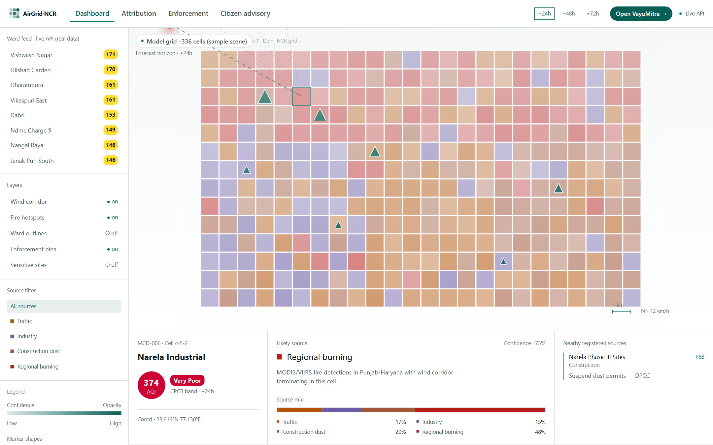
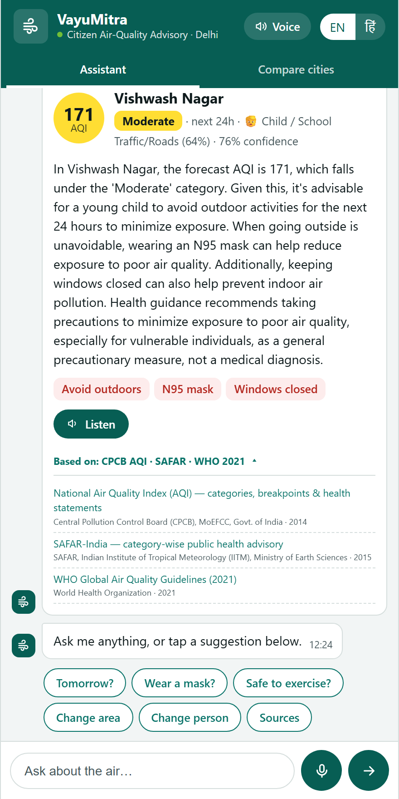
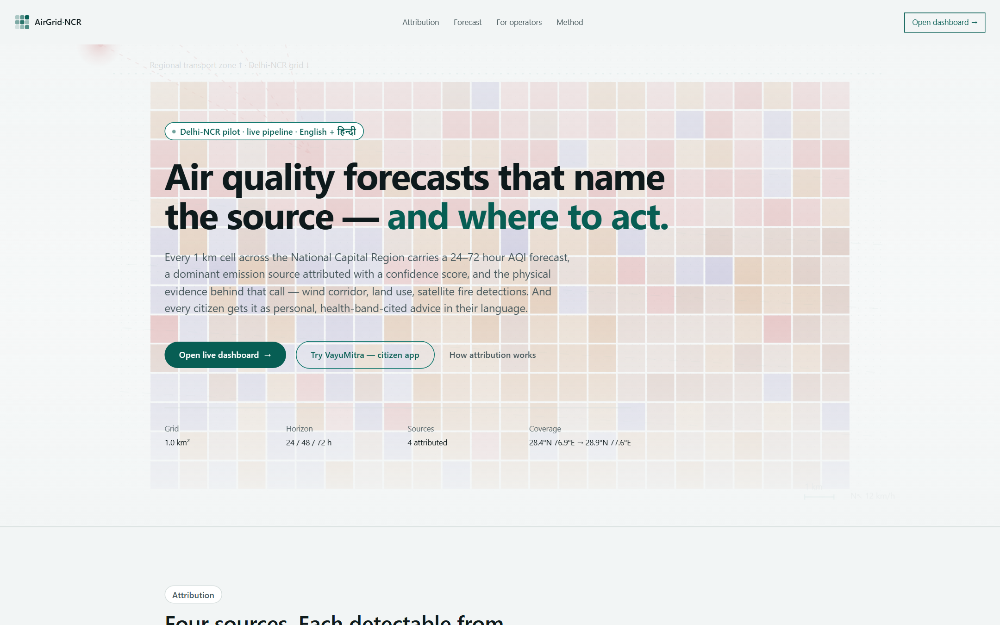
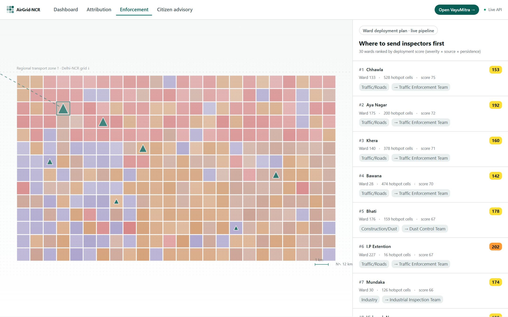
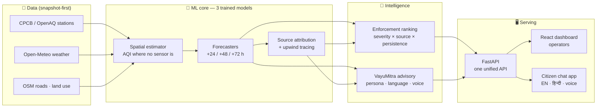

<div align="center">

# 🌬️ AirGrid · NCR

### Urban Air Quality Intelligence for Smart-City Intervention

**Delhi has 40+ air-quality sensors and no intelligence layer. We built one.**

*Which source is polluting you right now · what the air will be in 24–72 hours ·
where to send inspectors · and what **you** personally should do — in your language.*

<br/>

[](https://vayumitra-advisory.onrender.com)
[](https://airgrid-dashboard.onrender.com)
[](https://vayumitra-advisory.onrender.com/docs)


<sub>ET AI Hackathon 2026 · Problem Statement 5 · Team: Suhani · Parth · Krishna · Bind</sub>

</div>

---

> ⏱️ **Judging in a hurry?** Open the **[live citizen app](https://vayumitra-advisory.onrender.com)**, ask *"can my child play outside this evening?"*, tap **हिं** for Hindi, and tap **sources** under any answer — real forecasts for **209 named Delhi wards**, straight from the trained pipeline. Then open the **[operator dashboard](https://airgrid-dashboard.onrender.com)** → *Enforcement* for the live ward-deployment plan. That's Features 1–4 working end-to-end, deployed on real data.

---

## The problem

India's cities *measure* air pollution; they rarely *act* on it in time. Readings exist, but three questions stay unanswered every day:

1. **Which source** is driving pollution in *this* ward, *right now*?
2. **What will the air be** tomorrow and the day after — per locality, not city-wide?
3. **So what?** — where should inspectors go first, and what should a parent, an asthmatic, or an outdoor worker actually *do*?

**AirGrid** turns the existing sensor network into a ward-level intelligence layer that answers all three — for authorities *and* citizens.

## What we built — the five features

| # | Feature | What it does | Status |
|---|---------|--------------|:------:|
| 1 | **Hyperlocal AQI Forecasting** | 24/48/72-hour AQI per ~1 km cell — XGBoost forecasters + a spatial estimator predict air quality *where there are no sensors* | ✅ **live** |
| 2 | **Geospatial Source Attribution** | Per cell: traffic vs industry vs construction %, with **confidence scores** and **upwind-corridor evidence** (wind + land use + OSM) | ✅ **live** |
| 3 | **Enforcement Intelligence** | Severity × attribution × persistence → a **ranked ward-deployment plan** (which team, which ward, in what order) with evidence strings | ✅ **live** |
| 4 | **Citizen Health Advisory** 🌟 | **VayuMitra** — a multilingual (English/हिन्दी), voice-enabled assistant giving persona-specific advice (child · elderly · asthma · outdoor worker · pregnant), grounded in **CPCB · SAFAR · WHO · GRAP** citations | ✅ **live** |
| 5 | **Multi-City Comparison** | Same pipeline, second city (Mumbai) from one config block — band distribution, source mix, modelled intervention impact | ✅ built |

**On real data:** the deployed system serves the actual trained-pipeline output committed in `data/` — **1,600 one-km grid cells × 3 horizons**, aggregated to **209 named Delhi wards** (MCD boundaries), with a ranked deployment plan across all wards. Ask VayuMitra about *Chhawla* or *Narela* — those are real wards with real forecasts. Mumbai remains a labeled sample proving the multi-city architecture.

## See it

| Operator dashboard | Citizen advisory (VayuMitra) |
|:---:|:---:|
|  |  |
| *1 km grid · source attribution · wind corridors · enforcement pins* | *Persona-aware, health-band-cited, English + हिन्दी, voice* |

| Landing | Enforcement queue |
|:---:|:---:|
|  |  |

## How it works



**The honest split:** three small numeric models are **trained** (XGBoost — spatial estimation, forecasting, attribution features); language is **called** (Llama-3.3 via Groq, with deterministic fallbacks). Attribution is *directional evidence with confidence scores*, not exact plume physics — and the UI says so.

## Why VayuMitra is different

Most AQI apps show a number and a color. VayuMitra answers *your* question:

- 🧒 **Persona-aware** — *"can my child play outside?"* answers differently than *"can I go for a run?"*. Sensitive groups (children, elderly, asthma/heart, pregnant, outdoor workers) are warned a band earlier.
- 📖 **Every answer cites authority** — CPCB National AQI bands, SAFAR advisories, WHO 2021 guidelines, and the active **GRAP stage** — tappable, with publisher and year. No invented thresholds: the LLM phrases only what the deterministic engine and cited sources establish.
- 🗣️ **Speaks your language** — full English/हिन्दी parity, neural text-to-speech with pause/stop, mic input. Built for low-literacy users, not just app-natives.
- 🛡️ **Never breaks in a demo** — no API key? Deterministic templates. No data? Committed sample. No network? Browser voice. Every layer degrades gracefully.
- ⚖️ **Guidance, not diagnosis** — every message carries the disclaimer; low false-positive tone by design.

## Run it locally

**Backend + citizen app** (zero-config — runs fully without any API key):

```bash
pip install -r requirements-advisory.txt
uvicorn backend.main:app --reload --port 8000
# → http://localhost:8000/citizen   (VayuMitra)
# → http://localhost:8000/docs      (all endpoints)
```

Optional `.env` for live LLM + neural voice (copy `.env.example`): `GROQ_API_KEY` (free at console.groq.com), `DEEPGRAM_API_KEY`.

**Operator dashboard:**

```bash
cd frontend && npm install && npm run dev
# → http://localhost:8080
```

**Tests:** `python tests/test_advisory.py` → 18/18 offline (no keys, no network needed; pass on real and mock data).

## API at a glance

| Endpoint | Feature | Returns |
|---|:---:|---|
| `GET /api/v1/forecasts` | 1 | 24/48/72h AQI per cell |
| `GET /api/v1/attribution` | 2 | source %, confidence, evidence |
| `GET /api/v1/enforcement` | 3 | ranked action list |
| `GET /wards` | 1+2 | 209 real wards: AQI + band + dominant source |
| `GET /deployment` | 3 | ranked ward-deployment plan (team + score per ward) |
| `GET /enforcement/top` | 3 | top-20 enforcement targets with evidence |
| `GET /advisory` · `POST /chat` | 4 | cited, persona-specific advice (EN/HI) |
| `GET /tts` | 4 | streamed neural speech |
| `GET /compare` | 5 | multi-city summary + intervention model |
| `GET /sources` | 4 | the authority registry (CPCB · SAFAR · WHO · GRAP · NCAP) |

## Repository map

```
├── ml_pipeline/          # Feature 1: data fetch, training, prediction + enforcement scripts
├── models/               # trained XGBoost artifacts (24/48/72h + spatial)
├── notebooks/            # Feature 2: geospatial source attribution (wind-corridor evidence)
├── backend/              # unified FastAPI (api/v1 + advisory + citizen app)
├── advisory/             # Feature 4: personas, CPCB bands, sources, LLM, translate, TTS
├── compare/              # Feature 5: multi-city aggregation
├── frontend/             # React 19 operator dashboard (TanStack Start)
│   └── advisory_demo.html  # VayuMitra citizen app (self-contained)
├── config/city.yaml      # THE parameterisation: add a city = add a config block
├── data/                 # REAL pipeline output (forecasts, attribution, deployment)
│   └── mock/             # committed samples — everything still runs with zero data
├── PRODUCT.md · DESIGN.md  # our design system ("The Public Health Bulletin")
└── tests/                # 18 offline tests (pass on real AND mock data)
```

## Honesty notes (what we claim vs. don't)

- ✅ Ward-level estimation, forecasts, and attribution with stated confidence — **directional evidence**, not exact plume modelling.
- ✅ One city built deep (Delhi); the second city proves the architecture is a config block, not a rebuild.
- ✅ Language is a called LLM with deterministic fallbacks; it cannot invent health thresholds.
- ❌ No claim of medical advice, live-API operation at scale, or official government status.

## Team

| | Built |
|---|---|
| **Suhani** | Data pipeline captaincy · Feature 4/5 co-design |
| **Parth** | Feature 2 source-attribution engine · dashboard frontend base |
| **Krishna** | Feature 1 forecasting models · Feature 3 enforcement engine |
| **Bind** | Feature 4 VayuMitra (advisory · voice · i18n) · Feature 5 · unified backend · deploy |

<div align="center">
<sub>Built in 3 weeks for ET AI Hackathon 2026 · PS5 · Made with care for the 30 million people breathing Delhi's air 🫁</sub>
</div>
