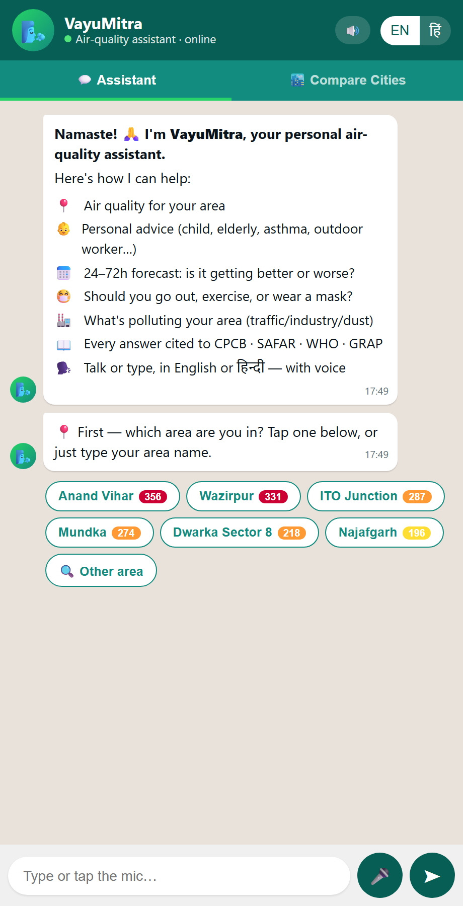
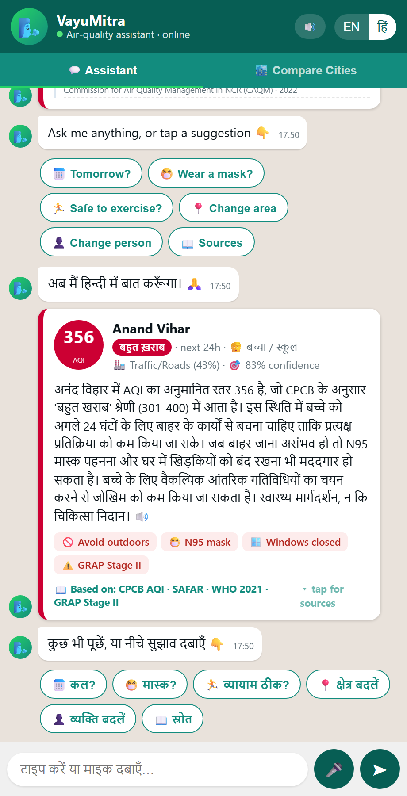

# VayuMitra — Citizen Health Risk Advisory (Feature 4) + Multi-City Compare (Feature 5)

**Owner:** Bind (+ Suhani) · **PS5 — Urban Air Quality Intelligence**

Turns the ward/cell-level **AQI forecast** (Feature 1) and **source attribution**
(Feature 2) into a **persona-specific, health-band-cited, multilingual** citizen
advisory — delivered through a WhatsApp-style chat with voice — plus a
**parameterised multi-city comparison** (Feature 5).

> One line: *"Tell me — in my language — what today's air means for **me** (my child, my
> asthma, my outdoor job), what to do about it, and cite the official CPCB health band."*

| Onboarding (asks in-chat) | Advisory + authentic sources | Hindi |
|---|---|---|
|  |  |  |

---

## What it does (maps to IMPLEMENTATION_PLAN §10.8)

- ✅ **Conversational, not a form.** It greets, lists what it can do, and **asks for
  your area and who it's for right in the chat** (tappable chips + free text). You can
  **change area or person any time** — tap a chip or just say *"what about Dwarka?"*.
- ✅ **Persona-aware.** child/school, elderly, asthma/heart, outdoor worker, pregnant,
  general. Sensitive personas escalate one band earlier — *"can my child play outside?"*
  answers differently from *"can I go for a run?"*.
- ✅ **Grounded in AUTHENTIC sources.** Every answer is anchored to and cites
  **CPCB National AQI (2014) · SAFAR-India (IITM/MoES) · WHO Global AQG (2021) ·
  CAQM GRAP** — shown as tappable references (publisher + year + link). The LLM is fed
  these facts and told never to invent thresholds. A **"📖 Sources"** view lists them all.
- ✅ **Multilingual.** English + **Hindi (Devanagari)** — messages, chips, and the
  whole UI. New languages = one config entry.
- ✅ **Voice.** Speech-to-text (mic) + text-to-speech in EN/HI with a warmer,
  non-monotone voice and **⏸ pause / ▶ resume / ⏹ stop** controls. No key needed.
- ✅ **Honest tone.** "Guidance, not diagnosis" on every message; low false-positive.
- ✅ **Feature 5 — Multi-city compare.** Delhi vs Mumbai band distribution, source mix,
  and a **modelled intervention-effectiveness** projection — proving the city is a
  config block, not new code.

**Two rules from the plan, honored:**
- **Zero-data:** runs on committed mock data if the real `data/source_attribution.csv`
  isn't present (auto-detected).
- **Zero-key:** runs fully without any LLM key (deterministic templates + a Hindi
  phrase table). A **Groq** key upgrades composition + translation to natural language.

---

## Quick start

```bash
pip install -r requirements-advisory.txt

# optional — natural language via Groq (free, OpenAI-compatible). Without it,
# the API still runs in deterministic template mode.
cp .env.example .env      # then paste your GROQ_API_KEY

uvicorn backend.advisory_api:app --reload --port 8000
```

Open **http://localhost:8000/** → the chat UI. Docs at **/docs** (FastAPI Swagger).

### Voice (optional, graceful)

The bot speaks via a server `/tts` endpoint that tries a neural voice and falls back
to the browser's built-in voice if no key/credit is available — so it always talks:

- **ElevenLabs** (`ELEVENLABS_API_KEY`) — multilingual, speaks **English + Hindi**. Primary.
- **Deepgram Aura** (`DEEPGRAM_API_KEY`) — **English** fallback (a warm neural voice).
- **Browser speech** — final fallback (Edge's `hi-IN`/`en-IN` neural voices are decent),
  with ⏸ pause / ▶ resume / ⏹ stop wired for every mode.

Set either key in `.env` (local) or the Render dashboard (deploy). For **Hindi neural**
voice, use an ElevenLabs key with remaining credits.

### Test it

```bash
python tests/test_advisory.py     # 11 offline tests (no network, no key)
python scripts/live_smoke.py      # eyeball live Groq EN+HI output
python scripts/verify_hi.py       # assert Hindi endpoints return Devanagari
```

---

## API reference

| Method | Endpoint | Purpose |
|---|---|---|
| GET  | `/health` | liveness + which LLM mode is active |
| GET  | `/meta` | cities, personas, languages, llm availability |
| GET  | `/wards?city=delhi` | all zones with current AQI + band + dominant source |
| GET  | `/advisory?zone=&persona=&horizon=&lang=&city=` | full structured advisory + message + **sources** |
| POST | `/chat` | `{zone, message, persona?, lang, horizon, history?, city?}` → grounded reply + sources (auto-switches area if the message names one) |
| GET  | `/sources` | the authentic reference registry (CPCB, SAFAR, WHO, GRAP, NCAP) |
| GET  | `/compare?cities=delhi,mumbai` | Feature 5 comparison |

Example:

```bash
curl "http://localhost:8000/advisory?zone=DL-ITO&persona=elderly&lang=hi"
curl -X POST http://localhost:8000/chat -H "Content-Type: application/json" \
  -d '{"zone":"DL-ANANDVIHAR","message":"can my child play outside?","lang":"en"}'
```

---

## How it fits the team's system (integration guide)

**Input contract** (what Features 1 & 2 must produce) — the real
`data/source_attribution.csv`, one row per `(cell_id, horizon_hours)`:

```
cell_id, lat, lon, horizon_hours, forecast_aqi,
dominant_source, dominant_source_pct,
traffic_pct, industry_pct, construction_pct,
confidence, confidence_label
```

Drop that file in `data/` and the advisory **auto-switches from mock → real** (the
`/wards` response shows `"data_kind": "real"`). No code change.

**Mounting into the shared backend** (`backend/main.py`) — the API is an
`APIRouter`, so the team's FastAPI can absorb it in one line:

```python
from backend.advisory_api import router as advisory_router
app.include_router(advisory_router)      # adds /advisory, /chat, /compare, /wards, /meta
```

**Merging into Parth's React frontend** — [frontend/advisory_demo.html](frontend/advisory_demo.html)
is deliberately framework-free; its three calls (`/wards`, `/advisory`, `/chat`) and
the card/chat markup port directly to a React component. It also stands alone for the
demo video today.

---

## Architecture

```
Feature 1 forecast ─┐
                    ├─► data/source_attribution.csv ──► advisory/data.py (normalise)
Feature 2 attrib. ──┘                                          │
                                                               ▼
   personas.py ─► advisory_engine.assess()  (deterministic: band, escalation,
 health_bands.py     │                        guidance flags, CPCB citation)
 (config/city.yaml)  ▼
              compose_message() ──► advisory/llm.py (Groq)  ──► translate.py (EN→HI)
                     │                     │ fallback ▲              │ fallback ▲
                     ▼                     └─ template ┘              └─ phrase table
              backend/advisory_api.py (FastAPI)  ──►  frontend/advisory_demo.html
                     │
              compare/city_compare.py  (Feature 5)
```

Files:
- `config/city.yaml` — CPCB bands, languages, **city registry** (the parameterisation).
- `advisory/health_bands.py` · `personas.py` — the deterministic grounding.
- `advisory/sources.py` — the authentic reference registry + LLM grounding snippets.
- `advisory/advisory_engine.py` — assessment + message composition.
- `advisory/llm.py` — Groq client (timeout → fallback, never crashes).
- `advisory/translate.py` — EN→HI, script-checked (forces Devanagari).
- `advisory/chat.py` — conversational orchestration.
- `compare/city_compare.py` — Feature 5 aggregation.

---

## Authentic sources (the grounding layer)

Every advisory is anchored to public, authoritative documents — never the LLM's
opinion. Registry in [advisory/sources.py](advisory/sources.py), served at `/sources`:

| Source | Publisher | Grounds |
|---|---|---|
| National Air Quality Index (2014) | CPCB, MoEFCC, Govt. of India | The 6 AQI bands + official health statements |
| SAFAR-India health advisory | IITM / Ministry of Earth Sciences | Category-wise exertion/mask guidance |
| Global Air Quality Guidelines (2021) | World Health Organization | Health-based PM limits |
| Graded Response Action Plan (GRAP) | CAQM (NCR) | AQI-stage emergency measures (shown at Poor+) |
| National Clean Air Programme (2019) | MoEFCC | Programme context |

The LLM is fed these facts and instructed to phrase only what's given; it can't set
its own thresholds. Users can open **📖 Sources** anytime to see the references.

## Honesty notes (state these in the pitch)

- Language is a **called** LLM (Groq/Llama-3.3), never trained by us; it degrades to
  deterministic templates so the demo never depends on the network.
- The advisory **never invents numbers** — it's anchored to the deterministic
  assessment and the authentic sources above; the LLM only phrases and translates.
- Feature 5's intervention figure is a **modelled projection** from source
  addressability, explicitly labelled — not a measured outcome.
- Health **guidance**, not medical diagnosis (shown on every message).
